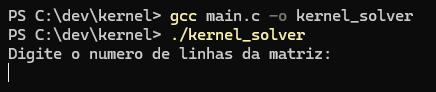
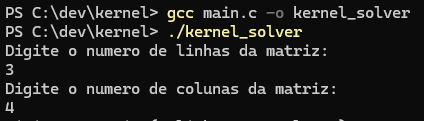
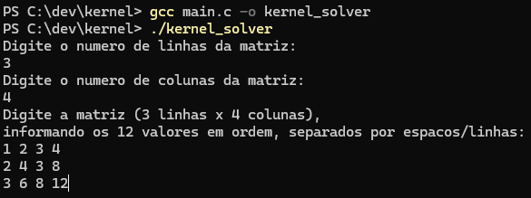
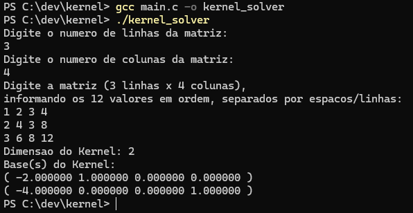

# Linear Algebra Kernel Solver

Uma implementação em C para encontrar a base do Kernel de qualquer matriz $m \times n$. Este projeto foi desenvolvido para a disciplina **MATA07 - Álgebra Linear A**, da **Universidade Federal da Bahia (UFBA)**.

## Sobre o Projeto

Este algoritmo utiliza **Eliminação Gaussiana** para transformar a matriz em sua forma escalonada e aplica **Back-Substitution** para identificar as variáveis livres e gerar os vetores da base do Kernel.

O projeto foi desenvolvido para lidar com:

- Matrizes quadradas e retangulares.
- Casos de solução trivial (Kernel = {0}).

## Como Compilar

Você precisará de um compilador C (como GCC).

```bash
# Compilar
gcc main.c -o kernel_solver

# Rodar
./kernel_solver
```

## Como Usar o Programa

### 1. Definir as Dimensões

Ao iniciar o programa, informe primeiro o número de **linhas** e, em seguida, o número de **colunas** da matriz.



### 2. Inserir os Dados da Matriz

Digite os valores da matriz em ordem. O programa aceita separação por espaços ou quebras de linha.



### 3. Visualizar a Dimensão

Após o processamento via eliminação gaussiana e substituição regressiva, o programa informará a **Dimensão do Kernel** (o número de variáveis livres).



### 4. Obter o Resultado Final (Base)

O programa exibirá os vetores que compõem a **Base do Kernel**. Cada vetor é apresentado entre parênteses.


